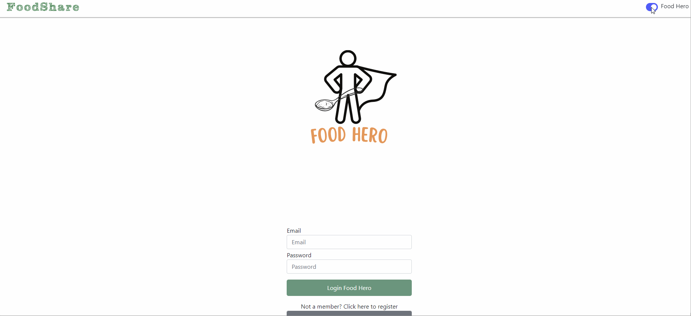

# Foodshare project

## Overview
Food waste is a huge issue. In the UK alone, we throw away around [9.5 million tonnes of food](https://lordslibrary.parliament.uk/food-waste-in-the-uk/) every year. Yet, there is a [surging demand for food banks](https://commonslibrary.parliament.uk/food-bank-demand-and-the-rising-cost-of-living/), with many turning to them for the first time. This project aims to tackle both of these problems, to reduce food waste and help those most in need.

Foodshare is a food waste app, which connects food banks to local restaurants, supermarkets and other food outlets who wish to donate their surplus food.

Our motto is “Waste not, want it”.

Foodshare has two types of users:
* Food heroes: supermarkets, restaurants and other food outlets who wish to donate their surplus food.
* Food rescuers: food banks who will receive the surplus food and distribute it to local households in need.

Note that the app acts as an intermediary and does not arrange for the collection and delivery of food. Food banks will be required to collect the food packages themselves. As such, the app aims to connect local donors to local food banks.

## Features

The app uses the MERN stack, with the programming languages HTML, CSS and React (JavaScript). When the user enter the homepage, they have the option to log in either as a food hero (food outlet and donor) or as a food rescuer (food bank and donee). They will then have a different user experience. 

### Food hero
The food hero will be provided with a donation form that they must complete. It will include a description of the food, collection location, time and so on. They will also be able to see a list of requests from local food banks. Whenever a collection has been booked by a food rescuer, the food hero will receive a notification of the booking, along with an ID. The ID  will be used by the food hero to verify the identificatication of the food rescuer. The food rescuer will also be able to download an impact report that details the outcomes of their donations.

### Food rescuer
The food bank will be able to see a map/list view of local food heroes and the available food packages. They will be able to filter this view for religious or dietary requirements. When a food bank finds a food hero that they wish to collect from, they can book a collection time. They will then receive a confirmation of the booking and an ID, which they will show to the food rescuer to confirm their identity. When a food bank has agreed to collect the food package, it will be removed from the map/list view. However, if the food rescuer does not collect the package within their alloted time slot, the package will be reuploaded onto the app.

## How to use
This project was created using the MERN stack, with the aim that it would become a website. Therefore, the user is not required to install any applications. However, this project was not intended to go live, so if you would like to view the code you would need to install the applications associated with the MERN stack

When the user first enters the foodshare site they see the signup donator page.

There are two sign up pages; food Hero for users who are donating food and food rescuer for those who are receiving food. Users are able to toggle between the two options using a toggle button in the upper right hand corner. 

Food heroes are asked to sign up to the service with their name, email, password, address and description. Food rescuers are only asked to provide their name, email and password in the sign up page. Existing users are able to log in using their email and password.

When a food hero has logged in, they will be greeted with a feed page. This will include a list of the donations that they have made, the status of each donation, its code, description, and expiry date. There is an 'Add your donation' button at the top of the page where users can add donations. There is a dropdown button beneath that where they can filter the list of donations by their status. The options are: available, pending, complete and unclaimed. 

For a food rescuer the feed page contains a list of available donations each containing a description, expiry date, the name of the food hero and a collect button. The food rescuer is also able to search through the donations using the search bar. There is also a 'My Account' button, where each rescuer can view their name, email and password. As with the food hero feed, there is a logout button.

## Contributors
Team Foodshare consists of:
* Arya Sunildath [aryadath](https://github.com/aryadath)
* Jamie Richardson [jam13richardson](https://github.com/jam13richardson)
* Madelane Daz [maddc0de](https://github.com/maddc0de)
* Manuela Iacobovici [ManuelaIacobovici](https://github.com/ManuelaIacobovici)
* Robin V [robinvuy](https://github.com/robinvuy)
* Solmaz Purser [bookloverbabe](https://github.com/bookloverbabe)